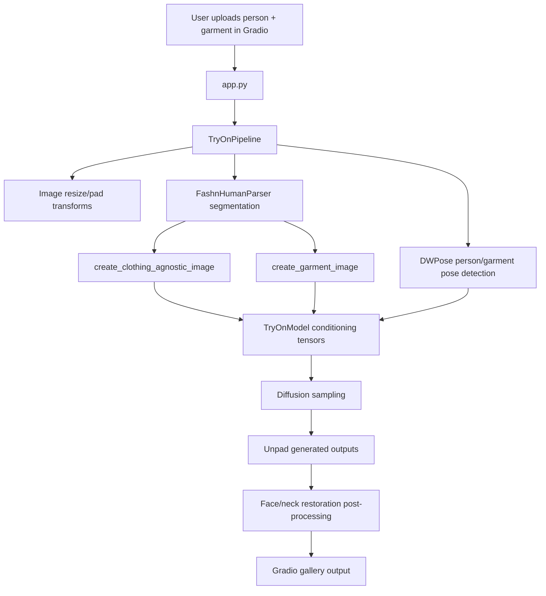

# AI Marketplace VTON Project Workflow

This document explains the virtual try-on project workflow, system architecture, important files, and the main methods/functions used across the codebase.

## 1. Project Purpose

This project runs a FASHN-style virtual try-on pipeline. It takes:

- A person image.
- A garment image.
- A garment category: `tops`, `bottoms`, or `one-pieces`.

It produces one or more generated images where the garment is virtually fitted onto the target person.

The system supports:

- Garment images worn by another model.
- Flat-lay/product garment images.
- Garment images with non-white or noisy backgrounds.
- Person images with different body poses, genders, and age groups.
- Long garments such as kurtis, frocks, midis, dresses, oversized tops, and one-pieces.

## 2. Runtime Workflow

The current interactive workflow uses Gradio.

1. User opens the Gradio app.
2. User uploads a person image.
3. User uploads a garment image.
4. User selects category from dropdown: `tops`, `bottoms`, `one-pieces`.
5. User selects garment photo type:
   - `auto`: detect whether garment image is model-worn or flat-lay.
   - `model`: garment is already worn by another person/model.
   - `flat-lay`: garment is a product/flat-lay image.
6. App sends images and settings to `TryOnPipeline`.
7. Pipeline preprocesses person and garment images.
8. Pipeline detects human pose with DWPose.
9. Pipeline segments person and garment with `fashn-human-parser`.
10. Pipeline creates:
    - Clothing-agnostic person image.
    - Processed garment conditioning image.
    - Person pose map.
    - Garment pose map.
11. Diffusion model generates try-on image.
12. Output is unpadded and post-processed to preserve face/neck skin.
13. Gradio displays the generated image gallery.

## 3. System Architecture



## 4. Main Entry Points

### `app.py`

Gradio application entry point.

Important functions:

- `get_hf_token()`
  - Reads Hugging Face token from `HF_TOKEN` environment variable.
  - Falls back to Colab userdata only when available.
  - Prevents crashes when `python app.py` is launched outside an active notebook kernel.

- `load_pipeline()`
  - Loads `TryOnPipeline` in a background thread.
  - Chooses `cuda` when available, otherwise `cpu`.
  - Stores pipeline state in global variables:
    - `pipeline`
    - `pipeline_ready`
    - `pipeline_error`

- `_prepare_image(image)`
  - Validates image upload.
  - Applies EXIF orientation correction.
  - Converts image to RGB.

- `tryon(...)`
  - Main Gradio callback.
  - Receives person image, garment image, category, garment type, sample count, timesteps, guidance scale, seed, and segmentation mode.
  - Calls `TryOnPipeline`.
  - Returns generated PIL images to the Gradio gallery.

- `pipeline_status()`
  - Returns current pipeline loading status for the UI.

Gradio controls:

- Person image upload.
- Garment image upload.
- Category dropdown:
  - `tops`
  - `bottoms`
  - `one-pieces`
- Garment photo type:
  - `auto`
  - `model`
  - `flat-lay`
- Samples slider.
- Timesteps slider.
- Guidance slider.
- Seed input.
- Segmentation-free checkbox.

### `vton.ipynb`

Colab notebook for testing the project.

Current workflow:

1. Check GPU availability.
2. Install Gradio and pyngrok.
3. Unzip project.
4. Change directory into project.
5. Install requirements.
6. Load `HF_TOKEN` from Colab secrets into environment.
7. Launch Gradio with:

```bash
GRADIO_SHARE=1 python app.py
```

The notebook no longer uses FastAPI Swagger/Uvicorn for testing.

### `examples/basic_inference.py`

Command-line inference example.

Important function:

- `main()`
  - Parses CLI arguments.
  - Loads person and garment images.
  - Loads `TryOnPipeline`.
  - Runs inference.
  - Saves result to output directory.

Example usage:

```bash
python examples/basic_inference.py \
  --weights-dir ./weights \
  --person-image ./examples/data/model.webp \
  --garment-image ./examples/data/garment.webp \
  --category tops
```

## 5. Core Pipeline

### `src/fashn_vton/pipeline.py`

This is the main orchestration layer for virtual try-on.

Important classes:

- `PipelineOutput`
  - Dataclass containing:
    - `images: List[Image.Image]`

- `TryOnPipeline`
  - Loads all models.
  - Preprocesses images.
  - Creates conditioning tensors.
  - Runs sampling.
  - Applies final post-processing.

Important constants:

- `CATEGORY_TO_LABEL`
  - Maps Gradio/user category strings to model category IDs:
    - `tops -> 1`
    - `bottoms -> 2`
    - `one-pieces -> 3`

- `GARMENT_LABEL_EXPANSIONS`
  - Expands parser labels used for garment extraction.
  - Helps when kurtis, dresses, frocks, or outerwear are categorized differently by the human parser.

Important methods:

- `__init__(weights_dir, device, logger)`
  - Stores weights path.
  - Sets device and dtype.
  - Validates required model weights.
  - Loads:
    - Try-on diffusion model.
    - DWPose model.
    - Human parser.
  - Initializes resize/pad transforms.

- `_validate_weights()`
  - Checks required files:
    - `weights/model.safetensors`
    - `weights/dwpose/yolox_l.onnx`
    - `weights/dwpose/dw-ll_ucoco_384.onnx`

- `_setup_tryon_model()`
  - Instantiates `TryOnModel`.
  - Loads checkpoint with `load_checkpoint`.
  - Moves model to selected device and dtype.

- `_setup_pose_model()`
  - Loads `DWposeDetector`.

- `_setup_hp_model()`
  - Loads `FashnHumanParser`.

- `_expanded_garment_label_ids(category, base_label_ids)`
  - Adds category-specific parser labels for garment masking.
  - Improves handling of one-pieces, dresses, long tops, and outerwear.

- `_pose_has_body(pose, min_visible_keypoints=5)`
  - Checks whether a garment image appears to contain a visible person.
  - Used by `garment_photo_type="auto"`.

- `_sample(...)`
  - Runs Euler-style diffusion sampling.
  - Uses classifier-free guidance.
  - Converts generated tensors to PIL images.

- `__call__(...)`
  - Main inference method.
  - Steps:
    1. Seed torch/numpy RNG.
    2. Resize person and garment images.
    3. Predict human parsing maps.
    4. Detect long garments.
    5. Detect sleeve type.
    6. Auto-detect garment photo type if requested.
    7. Draw pose maps.
    8. Build agnostic person image.
    9. Build processed garment image.
    10. Resize/pad all conditioning images.
    11. Convert images to tensors.
    12. Run diffusion sampling.
    13. Unpad outputs.
    14. Restore face/neck regions from original person image.
    15. Return `PipelineOutput`.

Key behavior for better VTON quality:

- Long garments and one-pieces force segmentation-driven masking to reduce cloth distortion.
- Garment images can be auto-classified as model-worn or flat-lay.
- Generated outputs preserve face/neck regions to avoid unwanted skin mutation.
- Post-processing resizes masks before blending, preventing shape mismatch errors.

## 6. Preprocessing Modules

### `src/fashn_vton/preprocessing/agnostic.py`

Creates person and garment conditioning images.

Important constants:

- `FASHN_LABELS_TO_IDS`
  - Human parser label-to-ID map.

- `BODY_COVERAGE_TO_FASHN_LABELS`
  - Maps body coverage groups to parser labels.

- `IDENTITY_FASHN_LABELS`
  - Labels that should usually be preserved, such as identity/skin areas.

Important functions:

- `_create_hybrid_contour_bounded_mask(...)`
  - Combines contour-following and bounding-box masks.
  - Removes overly aggressive regions that are too far from the actual garment contour.

- `create_garment_image(...)`
  - Creates the garment conditioning image.
  - For model-worn garment photos, masks non-garment regions to neutral gray.
  - Falls back to foreground estimation if segmentation area is too small.
  - For flat-lay images, neutralizes obvious non-garment background.

- `_neutralize_flat_lay_background(...)`
  - Replaces detected background with neutral gray for product/flat-lay images.

- `_estimate_foreground_mask(...)`
  - Estimates foreground using border-color difference and connected components.
  - Helps when garment images have non-white backgrounds.

- `create_clothing_agnostic_image(...)`
  - Masks target clothing/body regions in the person image.
  - Handles:
    - Long tops.
    - Kurtis.
    - Oversized shirts.
    - Frocks.
    - Midis.
    - One-pieces.
    - Sleeve-specific arm masking.
  - Preserves important identity regions like face, hands, legs, or feet depending on category.

### `src/fashn_vton/preprocessing/masks.py`

Mask utility functions.

Important functions:

- `dilate_mask(mask, kernel, iterations)`
  - Expands a binary mask.

- `create_bounded_mask(mask)`
  - Creates a mask covering the bounding rectangle of the input mask.

- `asymmetric_dilate_mask(mask, right, left, up, down)`
  - Dilates mask with different amounts in each direction.
  - Used to give garments more room to expand downward or sideways.

- `create_contour_following_mask(...)`
  - Inflates a mask while following garment contour.
  - Uses distance transforms and smoothing.

- `_max_pool_downsample(arr, factor)`
  - Downsamples supersampled masks.

- `_fill_holes_cv(binary)`
  - Fills holes inside binary masks.

### `src/fashn_vton/preprocessing/transforms.py`

Image resizing and padding utilities.

Important classes:

- `AspectPreserveResize`
  - Resizes PIL or OpenCV images while preserving aspect ratio.
  - Modes:
    - `fit`
    - `exceed`
    - `short`
    - `long`

- `PadToShape`
  - Pads an image to target width/height.
  - Stores padding memory when requested.
  - Can unpad generated outputs.

- `ResizePad`
  - Combines aspect-preserving resize and padding.
  - Used before feeding tensors into the model.

### `src/fashn_vton/preprocessing/garment_length.py`

Garment-length heuristic.

Important function:

- `is_long_garment(seg_pred, labels_ids_dict)`
  - Detects vertically long garments based on segmentation height/width ratio.
  - Used for kurtis, tunics, oversized tops, midis, and dresses.

### `src/fashn_vton/preprocessing/sleeves.py`

Sleeve-type heuristic.

Important function:

- `detect_sleeve_type(seg_pred, labels_ids_dict)`
  - Returns:
    - `sleeveless`
    - `short`
    - `long`
  - Used to decide how much of the arm region should be masked.

### `src/fashn_vton/preprocessing/__init__.py`

Exports preprocessing functions/classes:

- `create_clothing_agnostic_image`
- `create_garment_image`
- `FASHN_LABELS_TO_IDS`
- `BODY_COVERAGE_TO_FASHN_LABELS`
- `AspectPreserveResize`
- `ResizePad`
- `PadToShape`

## 7. Diffusion Model

### `src/fashn_vton/tryon_mmdit.py`

Defines the transformer/diffusion model architecture used for try-on generation.

Important functions/classes:

- `_attn_processor(q, k, v)`
  - Uses PyTorch scaled dot-product attention.

- `attention(q, k, v, pe)`
  - Applies rotary positional embedding and attention.

- `rope(pos, dim, theta)`
  - Creates rotary positional embeddings.

- `apply_rope(xq, xk, freqs_cis)`
  - Applies RoPE to query/key tensors.

- `EmbedND`
  - Multi-axis positional embedding.

- `RMSNorm`
  - Root mean square normalization.

- `QKNorm`
  - Normalizes query/key tensors before attention.

- `SelfAttention`
  - Self-attention block with QK normalization.

- `ModulationOut`
  - Dataclass holding modulation shift, scale, gate, and optional second stream values.

- `Modulation`
  - Generates conditioning modulation parameters.

- `DoubleStreamBlock`
  - Processes image/person stream and garment/text-like stream separately, then applies attention between them.

- `SingleStreamBlock`
  - Processes combined token stream.

- `LastLayer`
  - Final projection from hidden tokens back to image channels.

- `prepare(img, patch_size)`
  - Converts image tensor into model patch/token format.

- `PatchEmbed`
  - Converts image-like tensors to patch embeddings.

- `MLPEmbedder`
  - Small MLP for conditioning embeddings.

- `timestep_embedding(...)`
  - Creates sinusoidal timestep embeddings.

- `TimestepEmbedder`
  - Embeds diffusion timestep.

- `apply_conditional_dropout(...)`
  - Applies conditional dropout for classifier-free guidance training/inference behavior.

- `TryOnModel`
  - Main neural network.
  - Important methods:
    - `forward_for_cfg(...)`: runs conditional and unconditional branches for CFG.
    - `forward(...)`: forward pass using noisy image, timestep, pose maps, agnostic image, garment image, and category.

The pipeline does not train this model; it loads pretrained weights from `model.safetensors`.

## 8. Pose Detection Modules

### `src/fashn_vton/dwpose/dwpose.py`

High-level DWPose wrapper.

Important functions/classes:

- `draw_pose(pose, H, W, canvas_value=0, grayscale=False)`
  - Draws body, hands, and face pose onto a canvas.
  - Grayscale mode returns a 2D pose map expected by the model.

- `DWposeDetector`
  - Wraps whole-body pose estimation.

- `DWposeDetector._find_best_candidate(...)`
  - Selects the best detected person when multiple people are present.

- `DWposeDetector.__call__(oriImg, single=True)`
  - Runs pose estimation.
  - Normalizes keypoints.
  - Returns body, hand, and face keypoints.

### `src/fashn_vton/dwpose/wholebody.py`

Runs full body pose estimation.

Important class:

- `Wholebody`
  - Loads ONNX detector and pose models.
  - Calls detector first, then pose model.
  - Returns candidate keypoints and scores.

### `src/fashn_vton/dwpose/onnxdet.py`

YOLOX-style ONNX person detector utilities.

Important functions:

- `nms(boxes, scores, nms_thr)`
  - Non-maximum suppression.

- `multiclass_nms(boxes, scores, nms_thr, score_thr)`
  - Multi-class NMS.

- `demo_postprocess(outputs, img_size, p6=False)`
  - Converts detector outputs into boxes.

- `preprocess(img, input_size, swap)`
  - Prepares image for detector ONNX model.

- `inference_detector(session, oriImg)`
  - Runs detector and returns person boxes.

### `src/fashn_vton/dwpose/onnxpose.py`

ONNX pose-estimation utilities.

Important functions:

- `preprocess(...)`
  - Prepares cropped person regions for pose estimation.

- `inference(sess, img)`
  - Runs ONNX pose model.

- `postprocess(...)`
  - Decodes pose model output.

- `bbox_xyxy2cs(...)`
  - Converts bounding box into center/scale format.

- `_fix_aspect_ratio(...)`
  - Keeps pose crop aspect ratio valid.

- `get_warp_matrix(...)`
  - Builds affine transform matrix.

- `top_down_affine(...)`
  - Applies affine transform for top-down pose estimation.

- `get_simcc_maximum(...)`
  - Finds maximum SimCC keypoint locations.

- `decode(...)`
  - Decodes SimCC keypoints.

- `inference_pose(session, out_bbox, oriImg)`
  - Runs pose model over detector boxes.

### `src/fashn_vton/dwpose/utils.py`

Pose drawing utilities.

Important functions:

- `draw_bodypose_gray(...)`
- `draw_bodypose(...)`
- `draw_handpose(...)`
- `draw_facepose(...)`
- `draw_handpose_gray(...)`
- `draw_facepose_gray(...)`

The grayscale versions are important because model pose tensors should have shape:

```text
batch x 1 x height x width
```

### `src/fashn_vton/dwpose/__init__.py`

Exports DWPose public API.

## 9. Utility Modules

### `src/fashn_vton/utils/tensor.py`

Tensor/image conversion helpers.

Important functions:

- `numpy_to_torch(img)`
  - Converts NumPy image to torch tensor.
  - Handles RGB images and 2D grayscale pose maps.

- `normalize_uint8_to_neg1_1(x)`
  - Converts uint8 image tensor from `[0, 255]` to `[-1, 1]`.

- `_neg1_1_to_0_1(normed_img)`
  - Converts normalized tensor back to `[0, 1]`.

- `tensor_to_pil(img, unnormalize=False)`
  - Converts model tensor output to PIL image.

- `unpack_images(x, patch_size=2)`
  - Converts packed patch/tokens back to image layout.

### `src/fashn_vton/utils/sampling.py`

Sampling schedule helpers.

Important functions:

- `time_shift(mu, sigma, t)`
  - Applies time-shift transform.

- `get_rf_schedule(num_steps, mu=1.5, reverse=True)`
  - Creates rectified-flow timestep schedule.
  - Used by `TryOnPipeline._sample`.

### `src/fashn_vton/utils/checkpoint.py`

Checkpoint loading.

Important function:

- `load_checkpoint(checkpoint_path, device="cpu")`
  - Loads `.safetensors` checkpoint.
  - Returns model state dict.

### `src/fashn_vton/utils/keypoints.py`

Pose fallback utilities.

Important function:

- `get_dummy_dw_keypoints()`
  - Returns dummy invisible keypoints.
  - Used for flat-lay garment images where no garment-body pose exists.

### `src/fashn_vton/utils/logger.py`

Logging helpers.

Important classes/functions:

- `CustomFormatter`
  - Formats logger output.

- `setup_logger(...)`
  - Creates configured logger used by the pipeline.

### `src/fashn_vton/utils/common.py`

Small general-purpose helpers.

Important functions:

- `exists(val)`
- `default(val, d)`
- `cast_tuple(val, length=None)`
- `compact(input_dict)`

### `src/fashn_vton/utils/__init__.py`

Exports utility functions used by the pipeline.

## 10. Scripts

### `scripts/download_weights.py`

Downloads required model weights.

Important functions:

- `download_tryon_model(weights_dir)`
  - Downloads try-on model checkpoint.

- `download_dwpose_models(weights_dir)`
  - Downloads DWPose detector and pose ONNX files.

- `download_human_parser()`
  - Warms/downloads human parser dependencies.

- `main()`
  - CLI entry point for weight download.

Expected command:

```bash
python scripts/download_weights.py --weights-dir ./weights
```

### `scripts/debug_masks.py`

Debugging tool for segmentation, agnostic masks, and garment masks.

Important functions:

- `colorize_segmentation(seg_pred)`
  - Creates colored visualization of parser labels.

- `save_mask(mask, path, name)`
  - Saves binary mask image.

- `save_image(img, path, name)`
  - Saves image output.

- `create_clothing_agnostic_image_debug(...)`
  - Debug version of agnostic masking.
  - Saves intermediate masks.

- `create_garment_image_debug(...)`
  - Debug version of garment masking.

- `main()`
  - CLI entry point.

Use this script when clothing distortion, unwanted exposed skin, or wrong garment regions need visual debugging.

## 11. Tests

### `tests/test_pose_shapes.py`

Tests pose image and tensor shape behavior.

Important test groups:

- `TestDrawPoseShapes`
  - Verifies `draw_pose(..., grayscale=True)` returns 2D array.
  - Verifies RGB pose drawing returns `H x W x 3`.

- `TestNumpyToTorchShapes`
  - Verifies RGB image conversion.
  - Verifies 2D grayscale pose maps are handled correctly.

- `TestExpectedModelTensorShapes`
  - Verifies expected pose tensor shape:

```text
batch x 1 x height x width
```

Run tests with:

```bash
python -m pytest -q
```

## 12. Packaging and Environment Files

### `requirements.txt`

Runtime dependencies:

- PyTorch and torchvision.
- safetensors.
- ONNX Runtime GPU.
- Hugging Face Hub.
- FASHN human parser.
- NumPy, Pillow, OpenCV, Matplotlib.
- Gradio.

### `pyproject.toml`

Python package metadata and dependency declarations.

Important sections:

- `[build-system]`
- `[project]`
- `[project.optional-dependencies]`
- `[tool.setuptools.packages.find]`
- `[tool.black]`
- `[tool.ruff]`

### `Dockerfile`

Container build instructions for running the project in a Docker/Hugging Face Spaces style environment.

### `packages.txt`

System-level package dependencies for deployment environments that support this file.

### `README.md`

Current Hugging Face Spaces metadata/readme.

### `README_GIT.md`

Git/project notes.

## 13. Important Data and Tensor Shapes

Typical model input resolution is derived from `TryOnModel.input_shape`.

Important conditioning tensors:

- `ca_images`
  - Clothing-agnostic person image.
  - Shape: `batch x 3 x H x W`.

- `garment_images`
  - Processed garment image.
  - Shape: `batch x 3 x H x W`.

- `person_poses`
  - Grayscale person pose map.
  - Shape: `batch x 1 x H x W`.

- `garment_poses`
  - Grayscale garment pose map or dummy keypoints.
  - Shape: `batch x 1 x H x W`.

- `garment_categories`
  - Category IDs.
  - Shape: `batch`.

Model channel expectations:

- Generated/person stream receives noisy image + agnostic image + person pose.
- Garment stream receives garment image + garment pose.

## 14. Category Handling

Supported categories:

- `tops`
- `bottoms`
- `one-pieces`

The Gradio UI uses a dropdown with only these values to prevent invalid category input.

Internally:

- `tops` maps to upper-body coverage.
- `bottoms` maps to lower-body coverage.
- `one-pieces` maps to full-body coverage.

The pipeline also expands parser labels so that garments such as dresses, kurtis, oversized shirts, and outerwear can still be extracted even when parser labels do not match the selected category exactly.

## 15. Garment Photo Type Handling

Supported values:

- `auto`
- `model`
- `flat-lay`

Behavior:

- `auto`
  - Runs pose detection on garment image.
  - If enough visible body keypoints exist, treats garment image as model-worn.
  - Otherwise treats it as flat-lay.

- `model`
  - Uses pose information from garment image.
  - Masks non-garment areas using parser labels.

- `flat-lay`
  - Uses dummy garment pose.
  - Attempts to neutralize non-white/noisy backgrounds.

## 16. Masking Strategy

The masking strategy is central to avoiding:

- Distorted cloth.
- Skin exposure in unwanted regions.
- Incomplete coverage for kurtis/frocks/midis.
- Over-editing face/neck/identity regions.

Main rules:

- Long garments expand masks downward.
- One-pieces use full-body coverage.
- Short sleeves mask only upper arm regions.
- Long sleeves mask more of the arm region.
- Hands/feet/legs may be preserved depending on category.
- Face/neck are restored after generation.
- Flat-lay backgrounds are neutralized before model conditioning.

## 17. Common Failure Points and Where to Debug

### Distorted kurti/frock/midi output

Check:

- `is_long_garment` in `preprocessing/garment_length.py`.
- `create_clothing_agnostic_image` in `preprocessing/agnostic.py`.
- Category selected in Gradio.

### Exposed skin where garment should cover

Check:

- Long-garment downward extension.
- Body coverage from category.
- Parser labels included in `GARMENT_LABEL_EXPANSIONS`.
- Debug masks with `scripts/debug_masks.py`.

### Garment image has person/background still visible

Check:

- `create_garment_image`.
- `_estimate_foreground_mask`.
- Garment photo type selection.

### Pose tensor shape errors

Check:

- `draw_pose(..., grayscale=True)`.
- `numpy_to_torch`.
- `tests/test_pose_shapes.py`.

### Output post-processing shape errors

Check:

- Final face/neck restoration block in `TryOnPipeline.__call__`.
- Person image, generated output, and alpha mask dimensions.

## 18. Recommended Development Workflow

1. Make preprocessing or UI change.
2. Run syntax check:

```bash
python -m py_compile app.py src/fashn_vton/pipeline.py src/fashn_vton/preprocessing/agnostic.py
```

3. Run tests:

```bash
python -m pytest -q
```

4. Launch Gradio locally:

```bash
python app.py
```

5. In Colab, launch with sharing:

```bash
GRADIO_SHARE=1 python app.py
```

6. Test with:
   - Short T-shirt.
   - Short kurti.
   - Long kurti.
   - Frock/midi.
   - Model-worn garment image.
   - Flat-lay garment image.
   - Non-white background garment image.
   - Different person poses.

## 19. High-Level File Map

```text
app.py
  Gradio UI and app entry point.

vton.ipynb
  Colab setup and Gradio launch notebook.

src/fashn_vton/pipeline.py
  Main virtual try-on orchestration.

src/fashn_vton/tryon_mmdit.py
  Diffusion/transformer model definition.

src/fashn_vton/preprocessing/
  Image transforms, masks, agnostic image creation, garment preprocessing.

src/fashn_vton/dwpose/
  Pose detection and pose drawing.

src/fashn_vton/utils/
  Tensor conversion, checkpoint loading, logging, sampling, keypoint helpers.

scripts/
  Weight download and mask debugging tools.

examples/
  CLI inference example.

tests/
  Shape and preprocessing tests.
```

