# AI Virtual Try-On System

An AI-powered virtual try-on application built on top of the FASHN VTON v1.5 model. The system generates realistic try-on images by combining a person image and a garment image while preserving important identity features such as the face and neck regions.

The project includes additional preprocessing, garment handling, masking strategies, and a Gradio-based interface for interactive inference.

## Features

* Virtual try-on using FASHN VTON v1.5
* Support for:

  * Tops
  * Bottoms
  * One-pieces
* Automatic garment photo type detection:

  * Model-worn garments
  * Flat-lay/product images
* Support for non-white and noisy garment backgrounds
* Improved handling of:

  * Kurtis
  * Dresses
  * Frocks
  * Midis
  * Oversized tops
* DWPose-based pose estimation
* Human parsing-based garment segmentation
* Face and neck restoration post-processing
* Interactive Gradio interface
* GPU acceleration when available

---

## Sample Results

### Example 1

| Person Image | Garment Image | Generated Output |
|-------------|--------------|------------------|
| 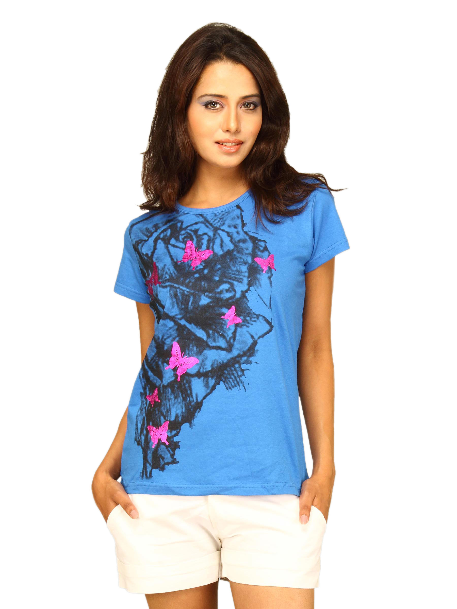 | 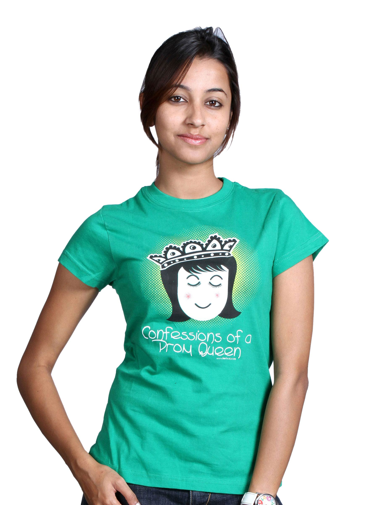 | 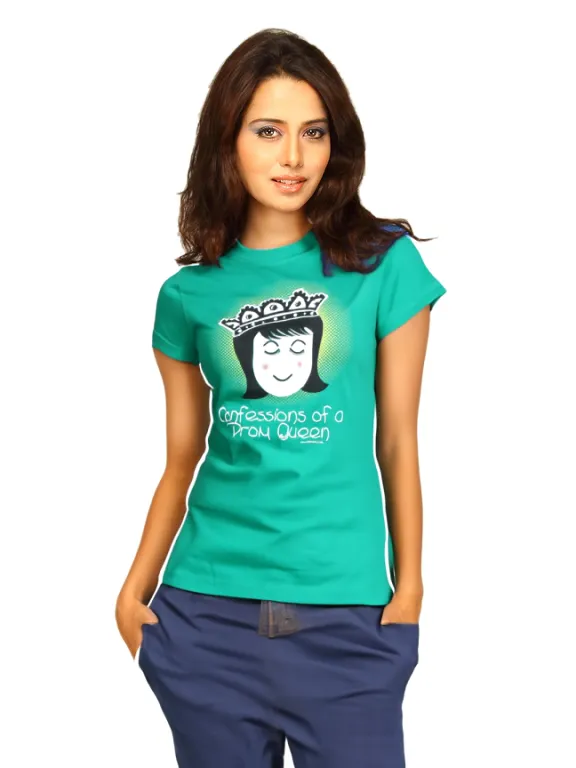 |

### Example 2

| Person Image | Garment Image | Generated Output |
|-------------|--------------|------------------|
| 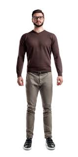 | 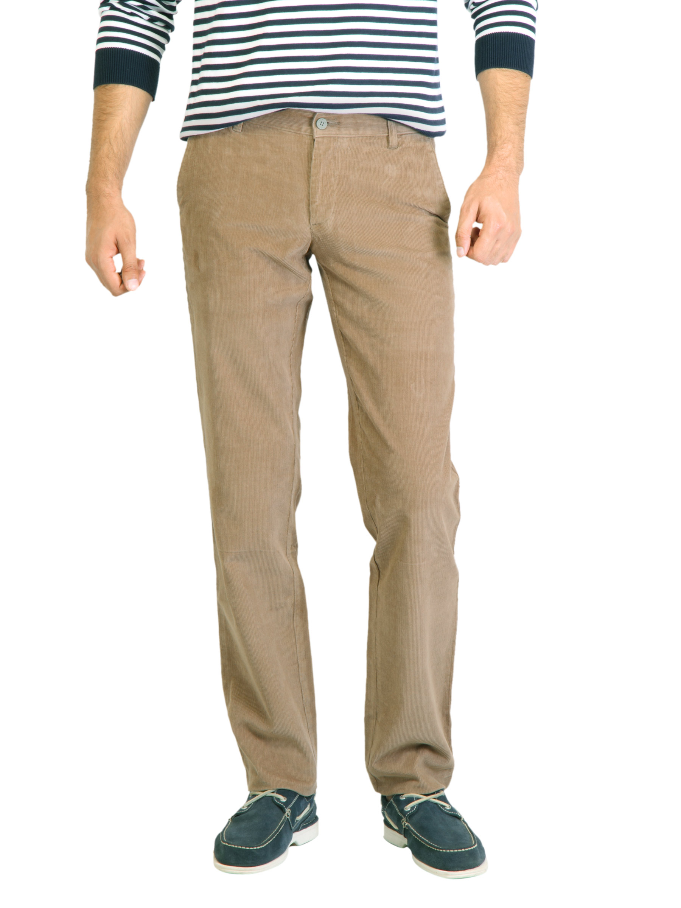 | 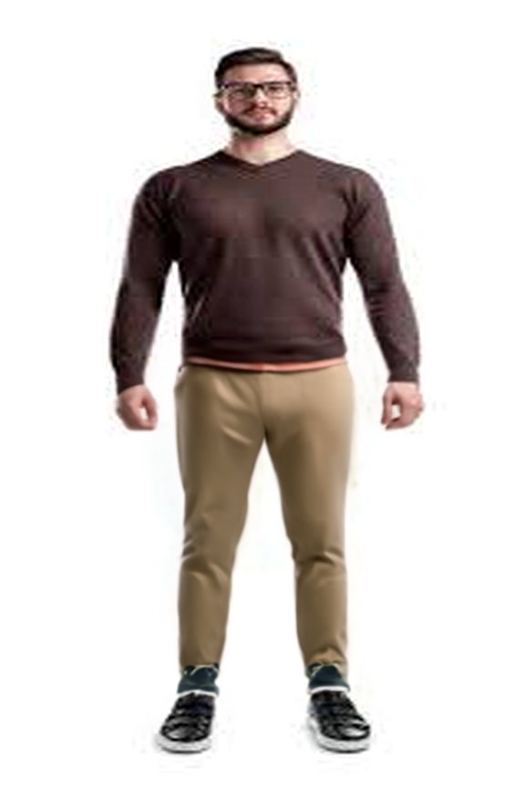 |

### Example 3

| Person Image | Garment Image | Generated Output |
|-------------|--------------|------------------|
|  | 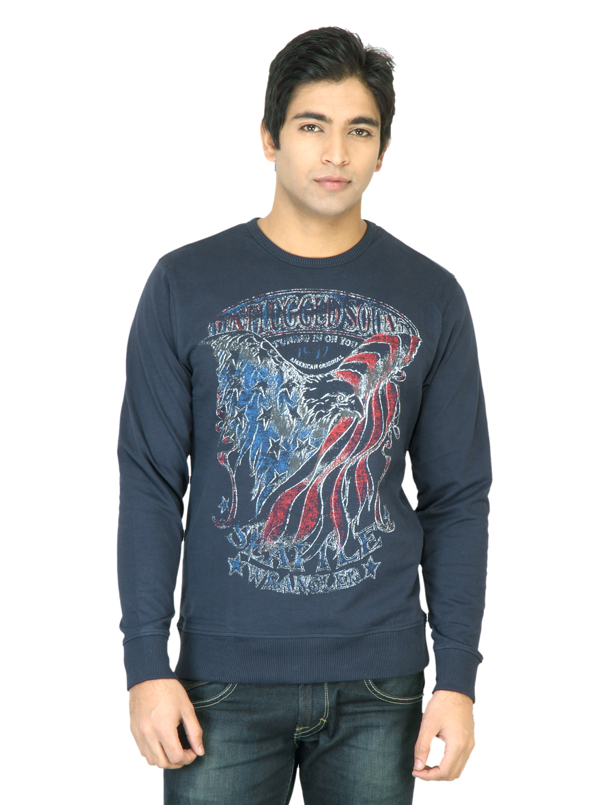 | 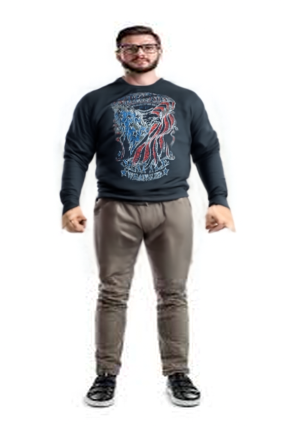 |

### Example 4

| Person Image | Garment Image | Generated Output |
|-------------|--------------|------------------|
| 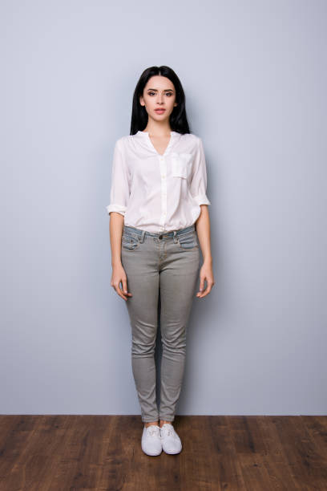 | 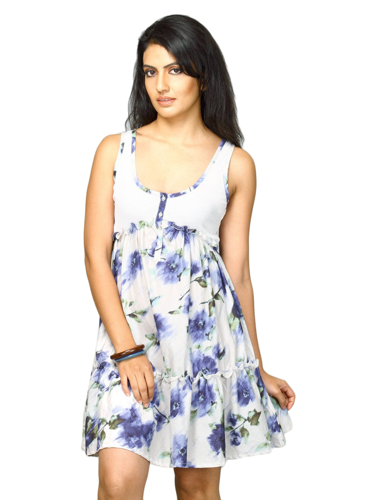 | 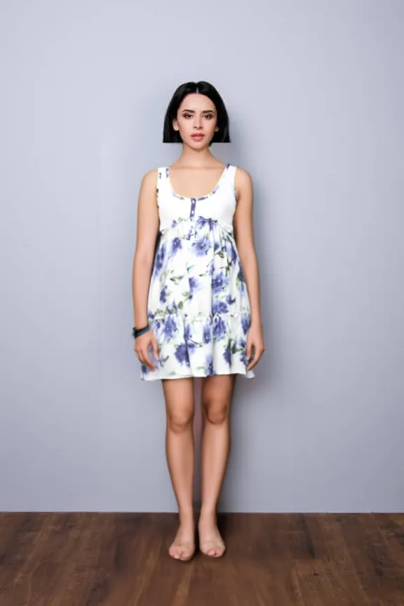 |

---

## System Workflow

1. Upload a person image.
2. Upload a garment image.
3. Select garment category:

   * tops
   * bottoms
   * one-pieces
4. Select garment photo type:

   * auto
   * model
   * flat-lay
5. Pipeline performs:

   * Pose detection using DWPose
   * Human parsing and segmentation
   * Clothing-agnostic image creation
   * Garment preprocessing
6. Diffusion model generates try-on output.
7. Post-processing restores identity regions and displays results.

---

## Tech Stack

* Python
* PyTorch
* FASHN VTON v1.5
* Gradio
* OpenCV
* ONNX Runtime
* Hugging Face Hub
* NumPy
* Pillow

---

## Installation

### Clone Repository

```bash
git clone <https://github.com/richa999513/virtual_tryon_system/tree/main>
cd <ai-marketplace-vton>
```

### Create Virtual Environment

Linux/macOS:

```bash
python -m venv .venv
source .venv/bin/activate
```

Windows:

```bash
python -m venv .venv
.venv\Scripts\activate
```

### Install Dependencies

```bash
pip install -r requirements.txt
```

---

## Hugging Face Token Setup

The application reads the Hugging Face token through the `HF_TOKEN` environment variable.

### Linux/macOS

```bash
export HF_TOKEN="your_huggingface_token"
```

### Windows PowerShell

```powershell
$env:HF_TOKEN="your_huggingface_token"
```

### Google Colab

Store the token as a Colab Secret named:

```text
HF_TOKEN
```

The application automatically loads the secret when running inside Colab.

---

## Model Weights

The application automatically checks for required model assets during initialization.

If weights are not available locally, download them manually:

```bash
python scripts/download_weights.py --weights-dir ./weights
```

Required assets include:

* FASHN VTON model checkpoint
* DWPose ONNX models

Some Hugging Face resources may be automatically downloaded and cached during first use.

---

## Running Locally

Launch the Gradio application:

```bash
python app.py
```

Once started, open the local Gradio URL displayed in the terminal.

---

## Running on Google Colab

### Enable GPU Runtime

```text
Runtime → Change Runtime Type → GPU
```

### Clone Repository

```bash
git clone <your-repository-url>
cd <your-repository-name>
```

### Install Dependencies

```bash
pip install -r requirements.txt
```

### Configure Hugging Face Token

Create a Colab Secret named:

```text
HF_TOKEN
```

and add your Hugging Face access token.

### Launch Application

```bash
GRADIO_SHARE=1 python app.py
```

Gradio will generate a public URL that can be accessed directly from the browser.

---

## Command Line Inference

Example:

```bash
python examples/basic_inference.py \
  --weights-dir ./weights \
  --person-image ./examples/data/model.webp \
  --garment-image ./examples/data/garment.webp \
  --category tops
```

Supported categories:

| Category   | Description                        |
| ---------- | ---------------------------------- |
| tops       | T-shirts, shirts, blouses, jackets |
| bottoms    | Pants, skirts, shorts              |
| one-pieces | Dresses, kurtis, jumpsuits, frocks |

---

## Project Structure

```text
app.py
vton.ipynb

src/
└── fashn_vton/
    ├── pipeline.py
    ├── tryon_mmdit.py
    ├── preprocessing/
    ├── dwpose/
    └── utils/

scripts/
├── download_weights.py
└── debug_masks.py

examples/
tests/
weights/
```

---

## Acknowledgements

This project builds upon the excellent work of the FASHN AI team and utilizes the pre-trained FASHN VTON v1.5 model.

Original Repository: https://github.com/fashn-AI/fashn-vton-1.5

Please consider citing and acknowledging the original authors if you use this project in research or derivative work.

---

## Disclaimer

This project uses pre-trained model weights provided by the FASHN VTON v1.5 project. The underlying model architecture, training methodology, and pretrained checkpoints belong to their respective authors.

This repository focuses on extending and integrating the original pipeline with additional preprocessing, masking strategies, garment handling improvements, and an interactive user interface.